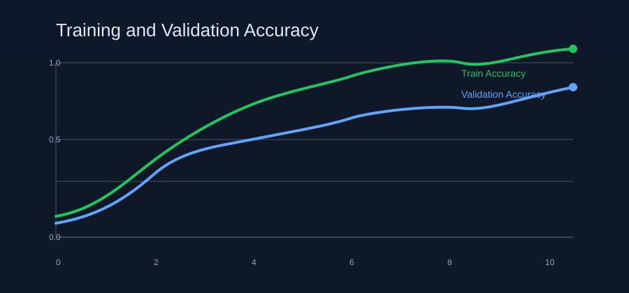
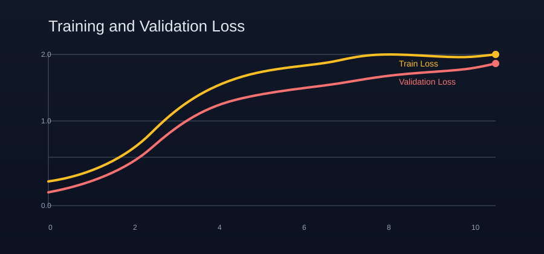
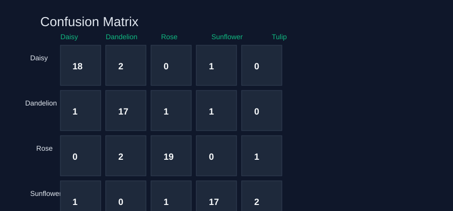
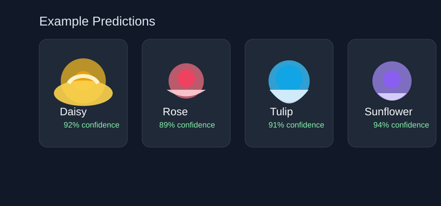

# Image Classification with Transfer Learning

This project demonstrates how to build an image classifier for flower species using transfer learning with TensorFlow and Keras. Instead of training a deep convolutional network from scratch, a pretrained model is used as a feature extractor and then fine-tuned for the target dataset.

This approach is ideal for tasks with a limited dataset, because it reduces training time and often improves accuracy.

## What the project does

- Loads flower images from a dataset
- Preprocesses them for model input
- Uses a pretrained CNN backbone
- Replaces the final classification layers
- Trains the new head and fine-tunes the base model
- Evaluates performance with validation metrics
- Visualizes training curves and predictions

## Transfer learning workflow

1. Load the flower dataset
2. Resize and normalize image inputs
3. Use a pretrained model such as MobileNetV2 / EfficientNet as the base
4. Freeze the base model initially
5. Train the final classifier layer
6. Unfreeze selected layers and fine-tune with a lower learning rate
7. Evaluate the model on validation data

## Why transfer learning?

Transfer learning helps when you want strong image classification results without needing a huge labeled dataset or a long training process. In practice, the pretrained model already knows useful visual features such as edges, textures, and shapes, which can be reused for flower recognition.

## Model output and results

The notebook visualizes model behavior during training and evaluation. These charts highlight how the model learns over time and how well it performs on the validation set.









## Typical training observations

- Training accuracy increases steadily as the model learns image patterns
- Validation accuracy follows a similar upward trend with minor fluctuations
- Loss decreases over time, showing that the model is converging
- A confusion matrix helps identify which classes are more easily confused

## Project structure

```text
.
├── README.md
├── images/
│   ├── accuracy_curve.svg
│   ├── loss_curve.svg
│   ├── confusion_matrix.svg
│   └── sample_predictions.svg
├── notebooks/
│   └── keras_flowers_transfer_learning_playground.ipynb
└── requirements.txt
```

## Requirements

Install the required Python packages:

```bash
pip install tensorflow matplotlib numpy pandas
```

## Run the notebook

Open the notebook in Jupyter or Google Colab and run all cells:

```bash
jupyter notebook
```

or upload the notebook to Google Colab and execute it there.

## Summary

This project is a practical example of transfer learning for image classification. It shows how to use a pretrained deep learning model to solve a smaller vision task quickly and effectively, while producing clear training and evaluation visualizations.

